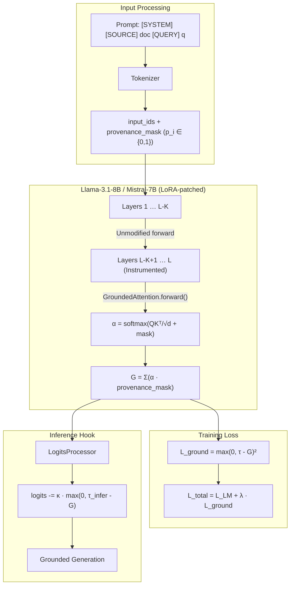

# AttnAnchor — Build Documentation

### Provenance-Constrained Attention Routing for Hallucination Suppression

| Field | Detail |
|---|---|
| **Document type** | Engineering build plan & lab notebook template |
| **Owner** | Solo ML Engineer / Capstone Researcher |
| **Duration** | 16 weeks (4 months), ~20–25 hrs/week |
| **Target artifact** | A working LoRA-patched Llama-3.1-8B or Mistral-7B with a custom attention grounding mechanism, a reproducible eval harness, and a defensible provisional-patent lab notebook |

---

## 0. How to Use This Document

This is written as a **phase-gated execution plan**. Each phase has:

- **Objective** — what "done" looks like
- **Exact steps** — what to run, build, or measure
- **Target** — the numeric bar you're trying to clear before moving on
- **Plan B / Plan C** — what to do if the primary approach fails, so you never get stuck for more than a few days
- **Notebook entry** — what to log for IP/patent documentation purposes (timestamped, in your own words, in a private git repo or physical notebook — this matters more than people think for later provisional filing)

> [!IMPORTANT]
> Treat every phase gate as a **go/no-go checkpoint**. Do not proceed to instrumenting the model until causal tracing (Phase 2) gives you a real answer about which layers matter — building on a guess wastes weeks.

---

## Phase 0 — Environment & Repo Setup (Days 1–3)

**Objective:** A reproducible, version-pinned environment where you can load Llama-3.1-8B / Mistral-7B, run inference, and diff your custom attention code against the original HF implementation.

### Exact Steps

1. **Provision compute:** A single GPU with ≥24 GB VRAM (RTX 3090/4090 local, or A10G/A100 on Colab Pro / Lambda / RunPod). 8B models in bf16 need ~16 GB just for weights — leave headroom for activations and LoRA optimizer states.

2. **Create an isolated environment:**
   ```bash
   conda create -n attnanchor python=3.11 -y
   conda activate attnanchor
   pip install torch --index-url https://download.pytorch.org/whl/cu121
   pip install transformers==4.44.0 accelerate peft bitsandbytes
   pip install nnsight transformer-lens
   pip install datasets evaluate sentencepiece
   ```

   > [!WARNING]
   > Pin every version in a `requirements.txt` immediately — you will patch internal HF module code, and a silent `transformers` upgrade will break your patch signature without warning.

3. **Clone the exact `transformers` version's source** for the model you're using so you can read the *real* `LlamaAttention.forward()` signature you'll be overriding (don't work from memory or from an old version's code).

4. **Set up a git repo** with a `docs/labnotebook.md` file. Every phase below ends with a required dated entry — this is your patent-strength provenance trail.

5. **Sanity check:** Load the base model, run 5 prompts, confirm generation works and note baseline tokens/sec and VRAM usage on your hardware. This is your **hardware baseline reference row** — you'll reuse it in every later benchmark table.

### Target

Model loads, generates coherent text, and you have logged baseline latency/VRAM numbers.

### Plan B

If 8B doesn't fit comfortably (e.g., you're on a 16 GB card), drop to Mistral-7B in 4-bit (`bitsandbytes` NF4) for early development, and only move to bf16/8B for final benchmark runs on rented cloud compute (budget ~$30–60 total for final-run A100 time).

### 📓 Notebook Entry

Hardware spec, software versions, baseline latency/VRAM table.

---

## Phase 1 — Data Pipeline: Provenance-Tagged Training Corpus (Days 4–10)

**Objective:** A dataset where every training example has token-level provenance labels (`p_i ∈ {0,1}`) distinguishing "source/context" tokens from "query/instruction/generation" tokens.

### Exact Steps

1. **Choose your base training corpus.** Recommended mixture:
   - **RAGTruth** — already has QA + source-document structure, and gold hallucination span annotations you'll need later for eval (get this early even though you use it mainly in Phase 5)
   - A slice of **XSum** or **CNN/DailyMail** reframed as "summarize this source document" tasks (source doc = provenance `1`, everything else = provenance `0`)

2. **Write a preprocessing script** that, for every example, constructs the exact prompt template you'll use in production and simultaneously builds a parallel **provenance mask array** the same length as the tokenized sequence:

   ```
   [SYSTEM] ... [SOURCE] {doc} [QUERY] {question} [ANSWER] {answer}
   ```

   - `1` for every token inside `[SOURCE]...[/SOURCE]`
   - `0` elsewhere

3. **Critical detail — tokenize-then-mask:**

   > [!CAUTION]
   > Tokenize with the *exact* tokenizer you'll use at inference, and build the mask **after** tokenization, not before — word-level tagging then re-aligning to subword tokens is a common, silent source of off-by-one bugs.

   Write a unit test that decodes tokens back to text and prints them next to their mask value for 10 random examples; visually confirm alignment before trusting it at scale.

4. **Store as a HuggingFace `datasets.Dataset`** with columns:
   - `input_ids`
   - `attention_mask`
   - `provenance_mask`
   - `labels`

5. **Target dataset size:** 8,000–15,000 examples is enough for LoRA fine-tuning at this scale — you are not pretraining, you're adapting a grounding *behavior*.

### Target

A dataset object where you can pull any example and confirm, by decoding, that `provenance_mask == 1` tokens are exactly the source-document tokens.

### Plan B

If RAGTruth's format is awkward to adapt, fall back to **synthetically constructing** provenance-tagged examples from any QA-with-context dataset (SQuAD 2.0, NarrativeQA) — you don't need gold hallucination labels for *training* data, only for the Phase 5 eval set.

### Plan C

If token-alignment bugs persist, switch to a coarser but bulletproof approach — insert explicit sentinel tokens (`<SRC_START>`, `<SRC_END>`) into the raw text before tokenization, then derive the mask deterministically from sentinel positions post-tokenization. Slightly wastes 2 tokens per example but eliminates alignment ambiguity entirely.

### 📓 Notebook Entry

Dataset schema, size, 3 worked examples showing prompt/mask alignment, and which dataset(s) you used and why.

---

## Phase 2 — Causal Tracing: Which Layers Actually Do "Content Selection"? (Days 11–20)

**Objective:** Empirical (not assumed) identification of the last-K transformer layers where intervening on attention meaningfully changes whether generation stays grounded in source content.

> [!IMPORTANT]
> This determines where you inject the mechanism in Phase 3 — **do not skip this and just guess "last 4 layers."**

### Exact Steps

1. **Instrument every layer** using `nnsight` (preferred over raw hooks for its clean API).

2. **Design a minimal-pair causal intervention experiment:**
   - Construct prompt pairs where the only difference is whether a key fact is present in the source context or not, and where the model is known to hallucinate the fact when it's absent.
   - For each layer `l`, patch that layer's attention pattern from the "grounded" run into the "hallucinating" run's forward pass and measure how much the output logit for the hallucinated token changes.

3. **Plot patching effect magnitude vs. layer index.** You are looking for the layer range where patching has the largest causal effect on the hallucination — this is empirically almost always concentrated in the last 20–30% of layers for 7–8B decoder-only models, but you must verify on your specific model.

4. **Cross-validate** with a second, cheaper heuristic: compute per-layer attention entropy over provenance-tagged vs. non-tagged tokens across ~200 examples, and look for the layer range where this divergence is largest.

5. **Pick K** (typically 4–8 layers) based on where the causal-patching effect curve plateaus, not just the single peak layer — you want a range robust to noise.

### Target

A layer-effect plot with a clearly identifiable "content selection" layer band, saved as a figure — this becomes both your architecture justification and part of your patent's technical specification.

### Plan B

If causal-patching signal is noisy/ambiguous, fall back to the cheaper attention-entropy-divergence heuristic alone, but explicitly note the higher uncertainty in your notebook and plan to revisit layer choice as an ablation in Phase 6.

### Plan C

If neither method gives a clean signal within your time budget (2 weeks max), default to literature-informed heuristic (last 25% of layers) and treat layer-range as a first-class hyperparameter to sweep in Phase 6 ablations. A defensible "we swept this and here's the sensitivity curve" is scientifically fine.

### 📓 Notebook Entry

Methodology, the effect-magnitude plot, final layer range chosen and justification. This is one of your strongest patent-documentation artifacts — it shows non-obvious, empirically-derived design choice.

---

## Phase 3 — Core Mechanism Implementation (Days 21–40)

This is the heart of the build. Break it into 4 sub-steps.

> [!IMPORTANT]
> Do not try to build training-loss and inference-hook simultaneously — get the grounding-mass computation correct and tested in isolation first.

---

### 3a. Grounding-Mass Computation Module

#### Steps

1. **Subclass** (don't monkey-patch) the attention module:
   ```python
   class GroundedLlamaAttention(LlamaAttention):
       def forward(self, ...):
           # ... standard attention computation ...
           # α = softmax(QK^T / √d + mask)
           G = (α * provenance_mask.unsqueeze(...)).sum(dim=-1)
           # ... return outputs + G ...
   ```

   > [!CAUTION]
   > Careful with broadcasting across `(batch, heads, query_pos, key_pos)` dimensions — this is the single most bug-prone line in the whole project.

   Write a standalone unit test with a synthetic 2-head, 5-token toy example where you hand-compute the expected `G` value and assert against it.

2. Confirm `G` is computed **only for layers in your Phase-2-selected range**; other layers run the unmodified forward pass.

3. Register the module via:
   ```python
   model.model.layers[i].self_attn = GroundedLlamaAttention(...)
   ```
   Copy over the pretrained weights exactly.

   > [!WARNING]
   > A very common bug is silently reinitializing weights when swapping module classes — verify by comparing output logits before/after the swap on a fixed prompt with `G`-computation temporarily disabled; outputs must match bit-for-bit or very near it.

#### Target

Swapped-in attention modules produce identical outputs to the original model when the grounding computation is a no-op, and produce a sane, plottable per-token `G` score.

#### Plan B

If subclassing conflicts with `torch.compile` or FlashAttention-2 kernels (FA2 doesn't expose the raw attention matrix needed for `G`), fall back to eager/SDPA attention (`attn_implementation="eager"` or `"sdpa"`) for the *instrumented layers only*, keeping FA2 for untouched early layers. Document the throughput cost — this itself becomes a legitimate benchmark result.

---

### 3b. Training-Time Loss

#### Steps

1. Implement the grounding loss:
   ```
   L_ground = max(0, τ - G)²
   ```
   Applied per generated-token position, masked to only apply during the "answer" span.

2. Combine into total loss:
   ```
   L_total = L_LM + λ · L_ground
   ```
   Start with `λ = 0.1`, `τ = 0.3` as initial guesses.

3. Wire into a standard HF `Trainer` or custom PEFT/LoRA training loop — LoRA adapters on `q_proj`, `k_proj`, `v_proj`, `o_proj` of instrumented layers plus the standard set on other layers.

#### Target

Training loss decreases smoothly; `L_ground` component specifically trends downward (grounding mass rises over training) without `L_LM` diverging.

#### Plan B

If `L_ground` and `L_LM` fight each other, switch from a fixed `λ` to a **warmup schedule** — train several hundred steps on `L_LM` alone first, then linearly ramp `λ` from 0 to target over the next N steps.

---

### 3c. Hyperparameter Sweep for τ and λ

#### Steps

1. Small grid:
   - `τ ∈ {0.2, 0.3, 0.4, 0.5}`
   - `λ ∈ {0.05, 0.1, 0.2, 0.5}`

   Run each combination for ~500–1000 steps on a data subset and compare validation `L_LM` and mean grounding-mass.

2. Pick the `(τ, λ)` pair that gives the best grounding-mass improvement at the smallest LM-perplexity cost.

#### Target

A documented sweep table — standard practice that also strengthens the patent narrative.

#### Plan B

If compute-constrained, use a Bayesian/random search over 8–10 configurations instead of grid search (Optuna, single-GPU-friendly).

---

### 3d. Inference-Time Logit-Suppression Hook

#### Steps

1. Implement as a `LogitsProcessor` (HF's standard extensibility point):
   ```
   logits -= κ · max(0, τ_infer - G) · non_grounded_token_mask
   ```
   Receives the current step's `G` score via a forward hook capturing the instrumented layers' attention weights.

2. For `non_grounded_token_mask` — simplest workable v1: apply a uniform temperature-style penalty, treating per-token selectivity as a Phase 6 improvement.

#### Target

With the source document artificially removed from context, the model should now produce visibly more hedged/refused outputs rather than confident hallucination.

#### Plan B

If the hook causes excessive refusals, reduce `κ` and/or apply suppression only to the top-p sampling pool rather than the full vocabulary.

### 📓 Notebook Entry (End of Phase 3)

Final architecture diagram (layers touched, tensor shapes at each stage), final `(τ, λ, κ)` values and sweep table, unit test results, before/after logit-suppression qualitative examples.

---

## Phase 4 — Training Run (Days 41–50)

**Objective:** A fully fine-tuned (LoRA) checkpoint of the grounded model, trained to convergence on your Phase 1 dataset with the Phase 3 loss.

### Exact Steps

1. **Full training run:** 2–3 epochs over ~10k examples, LoRA rank 16–32, learning rate ~1e-4 to 2e-4 with cosine decay, batch size as large as VRAM allows (use gradient accumulation to simulate effective batch ≥32).

2. **Checkpoint every 500 steps;** track both `L_LM` and mean `G` on a held-out validation split at each checkpoint.

3. **Save the checkpoint** with the best validation grounding-mass *without* validation-perplexity regression beyond ~5% relative to a plain-LoRA-no-grounding control run trained in parallel.

### Target

Final checkpoint shows measurable grounding-mass increase over the base/control model on held-out validation data, with LM perplexity within your pre-set tolerance band.

### Plan B

If validation perplexity regresses too much → return to Phase 3c with a narrower, more conservative grid centered on lower `λ` values.

### Plan C

If behind schedule, reduce scope to Mistral-7B only — one well-executed model beats two rushed ones.

### 📓 Notebook Entry

Training curves (loss, grounding-mass, perplexity over steps), final chosen checkpoint and why.

---

## Phase 5 — Evaluation Harness (Days 51–65)

**Objective:** Quantitative, reproducible comparison of your grounded model against baselines on the exact metrics promised in the proposal.

### Baselines

| Config | Description |
|---|---|
| **Baseline A** | Base model + standard RAG prompting, no grounding mechanism |
| **Baseline B** | Base model + post-hoc NLI/faithfulness reranker (DeBERTa-v3-large-MNLI) — the "current best practice" you must beat |
| **Baseline C** | Your model with LoRA + `L_ground` training but **without** the inference-time logit-suppression hook — isolates how much training-time loss alone contributes |
| **AttnAnchor** | Full system: LoRA + `L_ground` + inference hook |

### Evaluation Benchmarks

| Benchmark | Metrics |
|---|---|
| **RAGTruth** test split | Span-level hallucination precision/recall |
| **HaluEval** QA subset | Accuracy on hallucination-detection questions |
| **XSum-Faith** | FactCC and AlignScore faithfulness scores |
| **Generation quality** | ROUGE-L, BERTScore (quantify fluency cost) |
| **Latency overhead** | tokens/sec with vs. without hook |

### Key Analysis

**Grounding-mass-to-human-label correlation:** For RAGTruth examples with gold hallucination span annotations, check whether per-token `G` score at inference time is statistically lower on tokens inside gold-labeled hallucinated spans (point-biserial correlation or AUROC treating "is hallucinated" as the binary label and `1-G` as the score).

> [!IMPORTANT]
> This is the result that proves `G` is a genuine mechanistic signal, not just a training crutch. This is your single most important figure.

### Target

- ≥30% relative reduction in hallucination rate (RAGTruth span-level) vs. Baseline A, at ≤3% ROUGE-L degradation
- Full AttnAnchor beats Baseline B on hallucination rate at meaningfully lower latency
- Full AttnAnchor beats Baseline C, proving the inference hook adds value beyond training alone

### Plan B

If you hit ~15–20% rather than 30%, that's still defensible — report the honest number and add analysis on *why* (e.g., "grounding mass correlates well with extractive hallucinations but less with reasoning-based hallucinations").

### Plan C

If your model underperforms Baseline B on raw hallucination rate but wins on latency, reframe around the **quality-cost Pareto frontier** — "we achieve 90% of the hallucination reduction of the reranker baseline at 4× lower latency and no extra model needed."

### 📓 Notebook Entry

Full results table (all 4 configs × all metrics), the G-score / hallucination-label correlation plot, latency table.

---

## Phase 6 — Ablations & Robustness (Days 66–80)

**Objective:** Show the mechanism's design choices matter — needed for a strong report and for patent non-obviousness.

### Ablation Experiments

| # | Ablation | Purpose |
|---|---|---|
| 1 | **Layer-range:** single peak layer vs. K-layer range vs. all layers | Validates the chosen layer range |
| 2 | **Loss-only vs. hook-only vs. both** | Isolates each component's contribution — ties directly to patent claim |
| 3 | **Provenance-mask granularity:** coarse (document-level) vs. fine-grained (token-level) | Confirms token-level tagging is necessary |
| 4 | **Adversarial stress test:** prompt-inject text mimicking source phrasing | Tests robustness of provenance mask to manipulation |

> [!NOTE]
> Ablation #2 (loss-only vs. hook-only vs. both) is the highest priority — it's most directly tied to the core patent claim about the *combination* being novel.

### Target

A clean ablation table showing each design decision contributes measurably over the naive alternative.

### Plan B

Time-box this phase hard (2 weeks max). If behind, prioritize ablation #2 above all others.

### 📓 Notebook Entry

Ablation table, adversarial stress-test findings, honest limitations section.

---

## Phase 7 — Packaging, Report, and Patent Documentation (Days 81–100+)

**Objective:** A clean, reproducible open-source repo; a written report/paper draft; and a provisional-patent-ready technical disclosure.

### Exact Steps

#### 1. Repo Cleanup

- Clear README with setup instructions
- Single `train.py` / `eval.py` entrypoint
- Requirements pinned
- Demo script: loads final checkpoint, shows grounding-suppression behavior on 2–3 hand-picked prompts

#### 2. Report Structure

```
Abstract
  → Problem
  → Method (use Phase 3 architecture diagram)
  → Experiments (Phase 5 tables)
  → Ablations (Phase 6)
  → Limitations
  → Related Work
```

Position clearly against NLI-rerankers, RAG-consistency methods, and any 2025–26 attention-grounding papers found via literature search.

#### 3. Patent Technical Disclosure Draft

A structured 3–5 page engineering memo covering:

1. The specific problem
2. The exact mechanism with tensor-level detail from Phase 3 notebook entries
3. Specific claim elements:
   - Dual training + inference intervention
   - Provenance-mask-conditioned attention-mass constraint
   - Per-token mechanistic confidence signal
4. How it differs from closest prior art
5. Dated notebook entries as supporting evidence of independent invention and reduction to practice

> [!CAUTION]
> Public disclosure (a paper, a public repo) starts a filing clock in most jurisdictions (typically 12-month grace period in the US, but many other countries have no grace period). **File a provisional, or at least consult an attorney, before or immediately alongside public release if patent protection matters to you.**

### Target

Reproducible repo, complete report draft, disclosure memo ready to hand to an attorney.

### Plan B

If time runs short, prioritize the working demo + results table over final polish on the written report — a working, benchmarked system outperforms a polished write-up of an incomplete system.

---

## Master Risk Register

| Risk | Likelihood | Plan B | Plan C |
|---|---|---|---|
| FlashAttention incompatible with exposing attention weights | High | Use eager/SDPA attention on instrumented layers only | Accept throughput hit as a documented benchmark limitation |
| Grounding loss destabilizes LM training | Medium | Warmup schedule for `λ` | Lower `λ` ceiling, narrower `τ` range |
| Causal tracing signal is noisy | Medium | Use attention-entropy-divergence heuristic instead | Use literature-informed layer range + sweep as ablation |
| Compute budget runs out before full sweep | Medium | Bayesian/random search instead of grid | Reduce to single base model (Mistral-7B only) |
| Result falls short of 30% target | Medium-High | Report honest number + qualitative failure analysis | Reframe around Pareto frontier vs. reranker baseline |
| Adversarial prompt-injection defeats provenance tagging | High (expected) | Document as known limitation | Propose dynamic re-tagging extension as future work |
| Public repo release conflicts with patent filing timeline | Medium | Delay public release until provisional filed | Keep disclosure memo private, release only code |

---

## Timeline Summary

```mermaid
gantt
    title AttnAnchor — 16-Week Build Plan
    dateFormat  X
    axisFormat  Week %s

    section Foundation
    Phase 0 · Setup              :done, p0, 0, 1
    Phase 1 · Data Pipeline      :p1, 1, 2

    section Research
    Phase 2 · Causal Tracing     :p2, 2, 4

    section Build
    Phase 3 · Core Mechanism     :crit, p3, 4, 7
    Phase 4 · Training Run       :p4, 7, 9

    section Evaluation
    Phase 5 · Eval Harness       :p5, 9, 11
    Phase 6 · Ablations          :p6, 11, 13

    section Delivery
    Phase 7 · Packaging & Report :p7, 13, 16
```



| Phase | Weeks | Deliverable |
|---|---|---|
| **0.** Setup | 1 | Working environment + baseline numbers |
| **1.** Data | 1.5 | Provenance-tagged dataset |
| **2.** Causal Tracing | 1.5 | Layer-range justification plot |
| **3.** Mechanism Build | 3 | Working grounded attention + loss + hook |
| **4.** Training | 1.5 | Final checkpoint |
| **5.** Evaluation | 2 | Full results tables vs. 3 baselines |
| **6.** Ablations | 2 | Ablation table + limitations |
| **7.** Packaging | 3 | Repo, report, disclosure memo |

---

## Core Architecture at a Glance



---

*Last updated: 2026-09-08*
